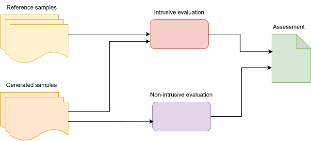
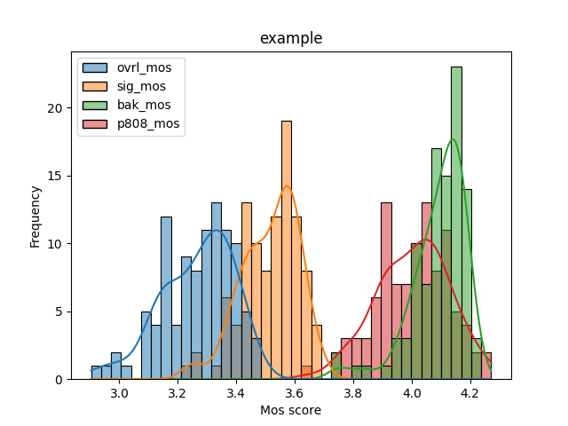

# Audio Evaluation Tool
This project was developed as major part of a Bachelor's Thesis at Brno University of Technoloogy, Faculty of information technology - Comparison and analysis of speech synthesizers.
The author of this project and said Bachelor's thesis is Roman Machala.

## Table of contents
- [Foreword](#foreword)
- [Must know](#must-know)
    - [Intrusive evaluation](#intrusive-evalaution)
    - [Used intrusive metrics](#used-intrusive-metrics)
    - [Non-intrusive evaluation](#non-intrusive-evaluation)
- [Installation](#installation)
- [Usage](#usage)
    - [Windows](#windows)
    - [Linux](#linux)
- [Input structure](#input-structure)
    - [Examples of structure](#examples-of-structure)
        - [Intrusive evaluation structure](#intrusive-evaluation-structure)
        - [Non-ntrusive evaluation structure](#non-intrusive-evaluation-structure)
- [Output structure](#output-structure)
- [Visualization](#visualization)
    - [Graphs section](#graphs-section)
    - [Tables section](#tables-section)
- [Adaptability](#adaptability)
- [Implementation details](#implementation-details)
    - [Evaluation](#evaluation)
    - [Logging mechanism](#logging-mechanism)
    - [Evaluation files uploading](#evaluation-files-uploading)
    - [Analysis processing](#analysis-processing)
    - [Dynamic section generation](#dynamic-section-generation)
    - [Samples visualization](#sample-visualization)
- [Literature](#literature)

## Foreword
Text-to-Speeh (TTS) is a system capable of synthesizing speech based on prived text input using the computer. These systems have made significant advancements in recent years, especially in nature, intelligibility, etc. This project aims to provide a **audio evaluation tool** for these systems to evaluate their capabilities concerning audio quality. This tool utilizes some **objective** evaluation metrics to assess audio. Compared to **subjective** metrics (such as MOS) that require human listeners, this approach is time and cost-friendly.

In short, this tool provides a simple, deterministic, reproducible, time- and cost-friendly audio assessment tool along with simple visualization.

## Must know
This system evaluates audio in intrusive and non-intrusive ways:
- **intrusive evaluation** - requires reference samples to compare reference and generated audio samples
- **non-intrusive** - requires only generated audio sample



### Intrusive evaluation
When performing an intrusive evaluation, the non-intrusive assessment is performed as well.

When using intrusive evaluation:
- compares reference and generated samples
    - make sure that you have your meta file set up correctly
    - make sure to use the exact transcriptions in reference and generated samples as different ones negatively affect results

**Also when making conclusions, make sure to make those conslusions based on several metrics - all metrics should be taken into consideration.**
- for example, an intrusive metric comparing generated audio's quality to a reference one showcasing worsened quality of a generated one doesn't mean the audio is low-quality or bad. The audio may perform well in non-intrusive evaluation. Such example can occur when generated audio's quality is lower than reference one because the audio contains artefacts, but the audio could still be intelligible with minimal distortions when listening to. This scenario could be interpreted in a way, that the system's ability to produce high-quality (or atleast quality close to the dataset's it was trained on) is limited, but the audio can still be good.
>**_NOTE:_** The intrusive evaluation compares generated audio to its reference one. The result of this evalaution is a value indicating audio quality of generated sample compared to the reference one. Intrusive metrics can be used to assess systems' ability to generate high-quality. 
>**_Possible usecases_**:
>- Zero-shot systems - let's say you have a dataset consisting of *x* audio samples of a single speaker. Take one sample out of this dataset and use this sample as a reference (to extract speaker embedings used in zero-shot synthesis). This sample will be used as a reference for the system to generate new samples with transcriptions matching the remaining *x - 1* samples left in your dataset. These left over audios will be your reference samples and generated ones will be generated samples in intrusive evalaution.
>- Single speaker models - you have a dataset consisting of *x* audio samples of a single speaker that were not used in training for the single speaker model you are using and the spekars matches in both your dataset and in used model. Generate *x* audio samples using the model with transcriptions matching the "human-made" dataset, which will serve as reference samples to your generated ones.
>*The aim of these scenarios would be to compare the ability of the system pro produce high-quality audio*
>**The metrics in these scenarios would showcase how much the generated audios differ from a reference, human-made ones**
#### Used intrusive metrics
The intrusive metrics used in this system are:
- PESQ - available at: https://pypi.org/project/pesq/
- STOI and ESTOI - available at: https://pypi.org/project/pystoi/
- MCD - available at: https://github.com/jasminsternkopf/mel_cepstral_distance

When comparing audio, they must be aligned first since the TTS system can produce faster/slower speech, different intonation, etc, which could negatively affect the evaluation. A FastDTW - Dynamic Time Warping function was used to align these audios, available at: https://pypi.org/project/fastdtw/.

### Non-intrusive evaluation
A MOS predictor, available at https://pypi.org/project/speechmos/, does the non-intrusive evaluation. This predictor is highly correlated with subjective evaluation metrics, thus providing reliable results regarding audio quality assessment. For each audio, the predictor returns:
- ovrl_mos - overall audio quality
- sig_mos - speech signal quality
- bak_mos - background quality
- p808_mos - reflects the overall quality of the audio sample based on subjective metrics
The **p808_mos** should be given the highest weight in this system.

## Installation 
It is recommended to create a conda environment as several dependencies are required for this system to run.

You can create an environment and install all dependencies using:
```
conda create --name AudioEval
conda activate AudioEval
pip install -r requirements.txt
```
And after that install the mel-cepstral-dostortion library
```
pip install git+https://github.com/jasminsternkopf/mel_cepstral_distance.git
```

## Usage
The system can be started in two modes:
- **command line mode** - starts evaluation and provides a result file in json format 
- **web mode** - provides a simple GUI for evaluation and visualization of results

If possible, the **web mode** approach is recommended.
It is also possible that the script might require *sudo*.
### Windows

### Linux
To use this system on linux, simply use the *start_eval.sh* script.

This command displays help on how to properly use this system along with example usages:
```bash
./start_eval --help
```

To start evaluation on a selected dataset and save results into test.json file use:
```bash
./start_eval.sh --dataset_path /path/to/dataset --meta_file /path/to/meta --save_path test.json
```

To start evaluation in **web mode** just simply use this command:
```bash
./start_eval.sh --web_mode true
```
The application will then be available at https://localhost:8000
## Input structure
The system expects a meta file (and optionally a path to a dataset).

**If the dataset path is not specified, the metafile must have absolute paths**
#### Examples of structure
This section shows examples of structures of datasets for intrusive and non-intrusive evaluations.

#### Intrusive evaluation structure
The dataset structure could be as follows:
```
dataset/
    |---audios_gen/
            |---sample_01.wav
            |---sample_02.wav
            |---sample_03.wav
                ...
    |---audios_ref/
        |---sample_01.wav
        |---sample_02.wav
        |---sample_03.wav
                ...
    |---meta
```
Then the meta file should be in format:
```
audios_ref/sample_01.wav audios_gen/sample_01.wav
audios_ref/sample_02.wav audios_gen/sample_02.wav
audios_ref/sample_03.wav audios_gen/sample_03.wav
    ...
```
If using absolute paths in meta file, the structure should be:
```
/dataset_path/audios_ref/sample_01.wav /dataset_path/audios_gen/sample_01.wav
/dataset_path/audios_ref/sample_02.wav /dataset_path/audios_gen/sample_02.wav
/dataset_path/audios_ref/sample_03.wav /dataset_path/audios_gen/sample_03.wav
    ...
```

#### Non-intrusive evaluation structure
The dataset structure could be as follows:
```
dataset/
    |---audios/
            |---sample_01.wav
            |---sample_02.wav
            |---sample_03.wav
                ...
    |---meta
```
Then the meta file should be in format:
```
audios/sample_01.wav
audios/sample_02.wav
audios/sample_03.wav
    ...
```
If using absolute paths in meta file, the structure should be:
```
/dataset_path/audios/sample_01.wav
/dataset_path/audios/sample_02.wav
/dataset_path/audios/sample_03.wav
    ...
```
## Output structure
The result of this system is then stored in a json file with format:
```
{
    "status": "completed",
    "path": "/dataset_path",
    "results": [
        {
            "file": "sample_01.wav",
            "metrics":{
                "Mcd": xy,
                "Pesq": xy,
                "Stoi": xy,
                "Estoi": xy,
                "Mos": {
                    "ovrl_mos": xy,
                    "sig_mos": xy,
                    "bak_mos": xy,
                    "p808_mos": xy
                }
            }
        }
    ]
}
```
## Visualization
When using the web mode for this system, all results can be visualized directly in your browser.
### Graphs section

For each file containing evalaution a set of graphs are generated for each metric available. For example a graph for non-intrusive evaluation (only MOS) can be seen below.


For metrics containing no values, no graphs are generated. Such as when using only non-intrusive evaluation, no graphs will be generated for intrusive metrics. Only a informational message that no valid values were found would be shown.
### Tables section
Besides graphs a set of tables is generatd containig fundamental statistical values for easy intepretation. Reagrding MOS - returning four MOS scores for each audio, for each MOS score a table is generated. The format of all tables can be seen below.
| File | Mean | Median | Min | Max |
| - | - | - | - | - |
| example | xy | xy | xy | xy |

### Audio section
For each *.json* file containing results of evaluation a set of audios is selected and displayed through the application for listening. 


To properly select these audios, it is crucial to leave the dataset stored at the same path that was used during evaluation. **After first analysis - uploading the json file, it is safe to relocate datasets, as copies of selected audios are made**.

## Adaptability
The current state of the evaluation tool utilizes a pre-determined set of evaluation metrics. These metrics can be changed, as well as visualization results. If you want to add a new evaluation metric or remove old one - for example beacause it may be outdated, present irrelevant data, just follow the simple steps described below.

> **_NOTE:_** make sure to use only evaluation results that have the matching set of evaluation metrics. 
*For example: when making an assessment, then adding a new metric and making another assessment, the visualization might not work in this scenario.*

In the [eval_dataset.py](eval/modules/eval_dataset.py) in functions:
```python
def get_audios(params):
    """Returns audios"""

def eval_audios(params):
    """Evaluate audios using selected metrics"""

    #add your custom evaluation metric here
    x = evaluate_x(audio)
    return mcd, pesq, stoi, estoi, mos, x

def process_line(params):
    """Processes line form metafile, loads audios and gets results"""
    ref_audio, gen_audio = get_audios()
    mcd, pesq, stoi, estoi, mos, x = eval_audios(ref_audio, gen_audio)
    # Get audio eval results with new metric added (x)
    results = {
        "file": audios,
        "metrics":{
            "Mcd": mcd if mcd else None,
            "Pesq": pesq if pesq else None,
            "Stoi": stoi if stoi else None,
            "Estoi": estoi if estoi else None,
            "Mos": mos if mos else None,
            "x": x if x else one # added new metric to the results
        }
    }
    return results # returns audio assessment results with new metric (x)
```
This code above lets you add new functionality to the system - you can add new metrics, remove old ones, adjust them to your needs.

In the [constants.py](eval/modules//constants.py) file is a predetermined structure for analysis result. When adding new metrics to the system **no adjustment is needed**, this structure serves as a backbone to show sections for these metrics even when no values are presented, even when removing the functions calls for these metrics. To remove those metrics entirely, just remove their mentions in this structure.

**All new metrics are added dynamically after finishing previous step** (adding function call and adding the result value to the *result* dictionary)
```json
PLOTS_RESULT = {
    "Pesq": [],
    "Stoi": [],
    "Estoi": [],
    "Mcd": [],
    "Mos": [],
    "tables": {
        "Files": [],
        "Values": {
            "Pesq": [],
            "Stoi" : [],
            "Estoi": [],
            "Mcd": [],
            "ovrl_mos": [],
            "sig_mos" : [],
            "bak_mos": [],
            "p808_mos": [],
        }
    },
}
```
The visualization is then based on the presented *json* result file, thus **no adjustment is needed**.

## Implementation details
The evaluation system app is developed as a server application using [Uvicorn](https://www.uvicorn.org/). It is suitable for single user as multiple-user handling wasn't considered. The purpose of this approach is to provide a simple GUI for evaluation and visualization.

The main core of this application is implemented in [eval_dataset.py](eval/modules/eval_dataset.py), where majority of the backend is. The main purpose of this module is to load audios from presented meta file, evaluate them and return results that are later handled in [audioEval.py](eval/audioEval.py).

The whole structure of audio evaluation could be summerize into simple pseudocode:
```python
for line in metafile:
    ref_audio, gen_audio = get_audios(line)
    results = evaluate_audio(ref_audio, gen_audio)

    return results
```
Each evaluation metric is imported as a module from it's own *.py* file located in moudels directory - for example the [pesq](eval/modules/metrics/pesq.py) metric.

### Evaluation
When using the *web mode* the application fetches results from an endpoint **/start-evaluation/**, defined in [audioEval.py](eval/audioEval.py). The main structure can be seen below:
```python
@app.post("/start-evaluation/)
async def start_evaluation(request)
    meta_file       = request.meta
    dataset_path    = request.dataset
    ...
    # Check whether meta file and dataset exists
    if not exists return 400
    # error while trying to evaluate dataset
    start_background(eval_dataset, meta_file, dataset)
    return 200
    # correct startup
```

This endpoint is accessed from [handleEval.js](eval/static/js/handleEval.js):
```js
function startEvaluation(){
    meta        = form.meta
    dataset     = form.dataset
    ...
    fetch("/start-evaluation/",{
        method: "POST",
        body: {meta, dataset, ...}
    })
    .then(response => {
        //handle response
        //display evaluation console, start streaming log
    })
    .catch(error => {
        //handle error
    })
}
```
### Logging mechanism
The process of evaluation can be analyzed directly in the web - a simple console window is present containing almost real-time logs. The logging mechanism is described bellow:
```python
async def log_generator():
    """
        Sends logs to frontend
    """
    global last_index # last index
    current_index = len(log_messages)
    #Sends only messages that weren't sent
    if last_index < current_index:
        for log in log_messages[last_index:]:
            yield log
        last_index = current_index
    await asyncio.sleep(2) # checks every 2 seconds for updates

@app.get("/log-stream/")
async def stream_logs():
    """
        endpoint for log streaming evaluation progress to frontend
    """
    return StreamingResponse(log_generator(), media_type="text/event-stream")
```

The streaming source is then accessed in [handleEval.js](eval/static/js/handleEval.js):
```js
function startLogStream() {
    // connect
    const eventSource = new EventSource("/log-stream/");
    eventSource.onmessage = function(event) {
        //handle new message
    };
    eventSource.onerror = function() {
        // error handling
    };
}
```
### Evaluation files uploading
For graphs and tables generation I used [pandas](https://pandas.pydata.org/) library for data manipulation and [seaborn](https://seaborn.pydata.org/) for data visualization.
The main logic for graphs creation and table values calculation can be seen in [analysis.py](eval/modules/plots/analysis.py). 
Firstly, files have to be uploaded, logic is described in [handleAnalysis.js](eval/static/js/handleAnalysis.js):
```js
document.getElementById("upload-form").addEventListener("submit", async function (event) {
    files = form.files;
    // handling files
    formData = addFiles(files);
    ...
    // fetching results
    try{
        // uploads json files containing evaluation results and creates a copy
        let response = await fetch('/upload/', {
        method: 'POST',
        body: formData
        });
        ...
        displayAnalysis(); //displays analysis
    }catch (error){
        //error handling
    }
});
```
The endpoint creates copies of all files in a pre-determined directory for easier manipulation and **to show previous analysis even after closing the application**. Thus there is no need to always upload files you want to see the evaluation of.
```python 
@app.post("/upload/")
async def upload_files(files):
    for file in files:
        createCopy(file, UPLOAD_PATH)
        #creates copy
    return code, valid_files #returns if copies were succesfully created
    #and valid files list
```
### Analysis processing
Below an endpoint for graphs and tables generation is described:
```python
@app.post('/process/')
async def process_files():
    result = {
        #this is json formatted response
        #contains all files examined - file names are used for titles in graphs
        #contains paths to generated graphs
        #contains values for tables (mean, median, min, max)
    }
    for file in UPLOADED_FILES:
        #Goes through all uploaded files
        for metric in file['metrics']:
            #Goes through all allowed metrics
            data = file[metric]
            if valid(data): #if valid values (atleast one is not NaN)
                # creates graphs
                if graph not exist:
                    path_to_graphs = analysis(data, metric)
                else:
                    path_to_graphs = existing_path_to_graph
                # gets values
                values = getTables(data, metric)
                result.add(values, path_to_graphs)

    return result # return result 
```
The graphs and values are then handled in [handleAnalysis.js](eval/static/js/handleAnalysis.js);
```js
function displayAnalysis(){
    try{
        let processResponse = await fetch('/process/', { method: 'POST' });
        ...
        if(response == ok){
            // if response is ok
            displayGraphs(graphs);
            displayTables(tables);
        }
    }catch(error){
        //error handling
    }
}
```
### Dynamic section generation
The sections for each metric are dynamicly generated based on the *.json* file and **allowedMetrics**. A pseudocode below describes how each section is created:
```js
const allowedMetrics = ["Pesq", "Mcd", ...]
function createSection(metric, graphs, values){
    section = selectMetricSection();
    newSection = createNewSection(metric);
    //creates new section with name metric
    section.add(newSection); //adds new section
    ...
    for path in graphs:
        // creates a new img element
        graph = createImg(path);
        newSection.add(graph); //adds graph to the section
}

function createTables(tables){
    for table in tables:
        //for each table (metric) 
        /*
        {
            "Pesq" : {
                [10, 20, 30, 40],   - table 1 to be displayed in pesq section
                [50, 60, 70, 80],   - table 2 to be displated in pesq section
                [mean, median, min, max]
            },
            ...
        }
        */
       newTable = createTable(table);
       addTableToSection(newTable)
}
```
### Sample visualization
And finally the sample visualization for listening:
```js
function displaySamples(){
    try{
        let processResponse = await fetch('/audios/', { method: 'POST' });
        ...
        if(response == ok){
            // if response is ok
            for each sample in samples:
                createNewAudioElement(sample);
        }
    }catch(error){
        //error handling
    }
}
```

## TODO
